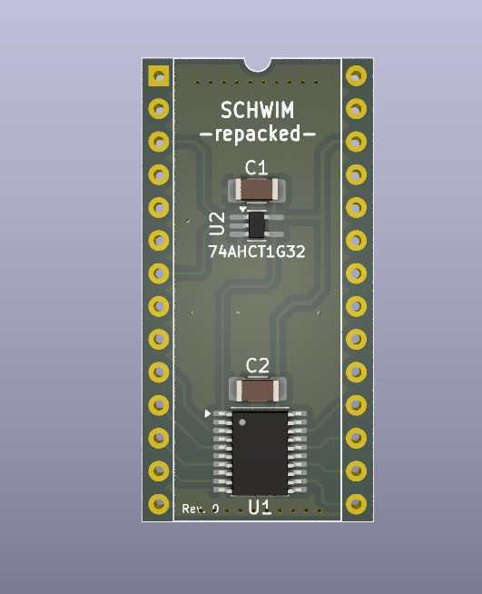

# SCHWIM Repacked

## DISCLAIMER

Any use of this project is **under your own responsibility**.
You will be responsible of checking the correct construction and functionality of your board.
By using this project You will agree that I cannot be held responsible if it will destroy any of your devices, damage your computer, burn down your house or whatever.

While the [design that this project is based on](https://github.com/DosFox1/Shim-IWM) was tested and is working, I have yet to build one of these boards, as such, **this project may contain errors and be non functional!!!**

## Introduction

This board is a SMD-based "replacement" of the (S)IWM for old Macintosh Computers, and is based on the work by [DosFox](https://github.com/DosFox1/Shim-IWM), of which it is just a repackaging in different format.

It implements enough of the logic to pass the initial boot check and allow the computer to continue booting. Floppy drive will not be functional. It is designed to fit in the same space as the original IC.

## Hardware

The board was designed with [KiCad](https://kicad.org/) EDA.

### Bill of Materials

| Component         | Qty | Type / Value                   | Notes                                                    |
| ----------------- | --- | ------------------------------ | -------------------------------------------------------- |
| C1, C2            |  2  | 100nF / 1206 / ceramic         |                                                          |
| U1                |  1  | 74HCT244                       | TSSOP-20                                                 |
| U2                |  1  | 74AHCT1G32                     | SOT-353                                                  |
| RN1, RN2          |  2  | 4x4.7K isolated resistor array | 4x0612 (1206 package)                                    |
| pins              |  2  | 14pin machined strips          | Solder these as pins of the replaced IC on the underside |  

